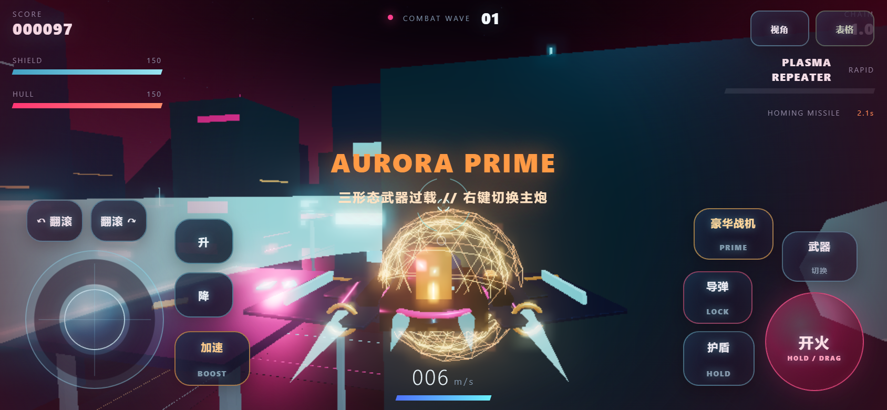

# NEON DRIFT MOBILE // 霓虹突围手游版

一款可直接在手机浏览器中游玩的横屏 3D 飞行射击游戏。无需安装 App，打开 GitHub Pages 链接即可开始，也可以从浏览器菜单“添加到主屏幕”。

## 手机操作

- 左摇杆：向上推进、向下刹车/倒飞、左右侧滑。
- 右侧空白区域：拖动进行无限 360° 转向。
- 开火：按住连续射击；按住后拖动也能继续瞄准。
- 加速、护盾、升降、左右翻滚：对应按钮需要按住。
- 武器、导弹、豪华战机、视角：点按触发。
- 表格：立即切换到摸鱼隐身页面；点击底部“工作簿已保存”返回战斗。

## 手机适配

- Pointer Events 多指输入，可以同时飞行、转向、开火和加速。
- 竖屏自动暂停战斗并提示旋转，返回横屏后平稳继续。
- 针对手机降低渲染像素密度、城市区块、粒子数量和连续音效开销。
- 使用安全区布局，兼容刘海屏与圆角屏幕。
- PWA 离线缓存：首次完整加载后，再次打开可使用已缓存资源。

## 微信分享

分享游戏链接 [https://lah308308-bit.github.io/neon-drift-mobile/](https://lah308308-bit.github.io/neon-drift-mobile/)，不要分享仓库文件地址或 Raw 地址。首次打开建议等待资源加载完成后横屏游玩。若微信内置浏览器限制全屏，可以使用右上角菜单选择“在浏览器打开”。

## 桌面兼容

页面仍保留键鼠操作：鼠标转向、W/S 前后、A/D 侧滑、Shift 加速、左键射击、右键切换武器、F 导弹、G 豪华战机、Space 护盾、Esc 隐身表格。
